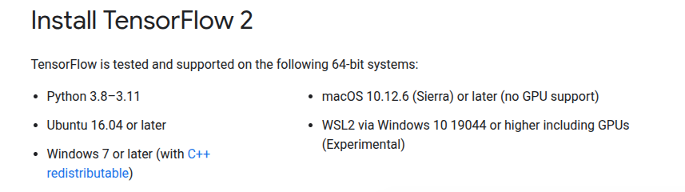

## Choosing a python version
- see available versions
```shell
conda search python
```
- create conda environment. We are choosing python 3.11 mainly because tensorflow currently does not support python larger than 3.11


## Setting up environment 
```shell
conda create -n jupyterhub python=3.11.7 conda
```
```shell
conda activate jupyterhub
```
```shell
poetry install
```

## Build base image first (jupyter/custom) for building jupyterhub image
This image is built on top of this [repo](https://github.com/jupyter/docker-stacks).
To reproduce follow the steps below:
- Clone repo 
```shell
git clone git@github.com:jupyter/docker-stacks.git
```
- Build the image(`jupyter/custom`) using the command below

```shell
docker build --rm --force-rm \
-t jupyter/custom ./images/pyspark-notebook \
--build-arg python_version=3.11.10 \
--build-arg openjdk_version=11 \
--build-arg spark_version=3.4.1 \
--build-arg hadoop_version=3 \
--build-arg spark_download_url="https://archive.apache.org/dist/spark/" \
--platform linux/amd64
```
- If you are just adding a package instead of starting from `jupyter/custom` consider starting from your existing/current image of jupyter to minimize changes to user experience

## Additional information 
- `gcs-connector-hadoop3-2.2.11-shaded.jar` is added to spark 
- `google-cloud-cli-458.0.1-linux-x86_64.tar.gz` is installed
- python package requirements are added from poetry project
- spark-defaults are to be mounted with the deployment in data-tasks repo. 
They should contain the image build from `data-science/pyspark` folder

## Build & publish
- patch
```sh
make patch publish
```
- minor 
```sh
make minor publish
```
- major 
```sh
make major publish
```

